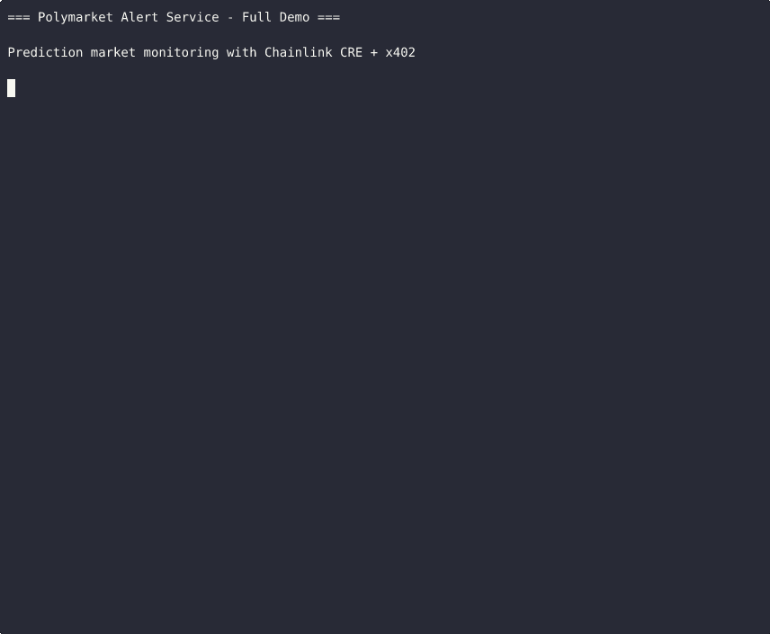

# Polymarket Alert Service

[](https://github.com/Fulcria-Labs/polymarket-alert-service/actions/workflows/test.yml)

**Chainlink Convergence Hackathon 2026 - AI Agents + Prediction Markets Track**

A prediction market monitoring service that combines Chainlink CRE workflows with x402 micropayments, enabling users to subscribe to custom alerts for prediction market conditions.

## Demo

[](https://asciinema.org/a/SYej79kvhGWSiN6R)

**Live Terminal Demo:** https://asciinema.org/a/SYej79kvhGWSiN6R



## Features

- **Advanced Natural Language Parsing**: Understands diverse phrasings
  - "Alert me when Trump election odds exceed 60%"
  - "Notify if recession probability drops below 30%"
  - "Watch Bitcoin ETF approval at 70 cents"
  - "Trump > 70%" (shorthand)
- **Multi-Condition Alerts**: "Alert when Trump > 60% AND Biden < 40%"
- **Smart Keyword Extraction**: Automatically finds relevant markets from your query
- **x402 Micropayments**: Pay $0.01 USDC per alert subscription on Base
- **Bulk Discounts**: 10% off for 5+ alerts, 20% off for 10+ alerts
- **Real-Time Monitoring**: CRE workflow checks markets every 5 minutes
- **Price History Tracking**: CRE builds market price history over time
- **Trend Detection**: Momentum-based alerts (surging, trending, stable)
- **Portfolio Tracking**: Multi-market watchlists with weighted performance
- **Correlation Analysis**: Pearson correlation matrix between markets
- **Divergence Detection**: Alerts when correlated markets diverge
- **Arbitrage Detection**: Single-market & cross-market mispricing scanner
- **Advanced Market Correlation**: Rolling correlation, regime detection, clustering
- **Conditional Probability**: Bayesian P(B|A) estimates with confidence intervals
- **Market Maker Detection**: Accumulation, distribution, spread, mean-reversion patterns
- **Cross-Market Arbitrage**: Mutually exclusive, subset, and complementary opportunity scanning
- **Backtest Engine**: Simulate alert strategies against historical data with P&L tracking
  - Strategy builder with entry/exit conditions, stop loss, take profit
  - Performance metrics: Sharpe ratio, Sortino ratio, max drawdown, profit factor
  - Monte Carlo simulation for confidence intervals on strategy robustness
  - Walk-forward optimization for parameter tuning
  - Strategy comparison and ranking across multiple strategies
- **Webhook Notifications**: Get notified when your conditions are met
- **Market Search**: Find prediction markets by keyword

## Quick Start

```bash
# Install dependencies
bun install

# Run unit tests (2476 tests across 37 suites)
bun test

# Run integration test
bun run index.ts --test

# Start API server (dashboard at http://localhost:3000)
bun run index.ts
```

## Web Dashboard

The service includes a built-in web dashboard at `/` that provides:
- **Market Search** - Search Polymarket for active prediction markets
- **NLP Alert Creation** - Create alerts using natural language with the x402 payment flow
- **Trend Visualization** - Click any market to see real-time trend analysis and momentum
- **Alert Management** - View and monitor all active alerts

*The web dashboard provides a search interface for Polymarket prediction markets, an NLP-powered alert creation form with x402 payment integration, real-time trend visualization with momentum indicators, and an alert management panel showing all active conditions and their status.*

## API Endpoints

| Endpoint | Method | Description |
|----------|--------|-------------|
| `/health` | GET | Health check |
| `/markets/search?q=election` | GET | Search prediction markets |
| `/markets/:id` | GET | Get market details |
| `/markets/:id/history?hours=24` | GET | Price history (CRE-tracked) |
| `/markets/:id/trend?outcome=Yes` | GET | Trend analysis & momentum |
| `/alerts` | POST | Create alert (x402 payment required) |
| `/alerts` | GET | List your alerts |
| `/payment-info` | GET | Payment instructions |
| `/pricing?count=10` | GET | Calculate bulk pricing |
| `/portfolios` | POST | Create portfolio watchlist |
| `/portfolios` | GET | List portfolios |
| `/portfolios/:id` | GET | Portfolio performance |
| `/portfolios/:id` | DELETE | Delete portfolio |
| `/correlation?markets=m1,m2` | GET | Correlation matrix |
| `/divergences?markets=m1,m2` | GET | Divergence detection |
| `/arbitrage/scan` | POST | Scan for arbitrage opportunities |

## Creating an Alert

### 1. Search for a Market

```bash
curl http://localhost:3000/markets/search?q=trump
```

### 2. Create Alert (Triggers 402 Payment)

**Simple Alert:**
```bash
curl -X POST http://localhost:3000/alerts \
  -H "Content-Type: application/json" \
  -d '{
    "naturalLanguage": "Alert me when Trump odds exceed 60%",
    "notifyUrl": "https://your-webhook.com/alerts"
  }'
```

**Multi-Condition Alert:**
```bash
curl -X POST http://localhost:3000/alerts \
  -H "Content-Type: application/json" \
  -d '{
    "naturalLanguage": "Alert when Trump > 60% AND recession < 30%",
    "notifyUrl": "https://your-webhook.com/alerts"
  }'
```

### Supported Phrasings

| Pattern | Example |
|---------|---------|
| Percentage | "when Trump exceeds 60%" |
| Cents (Polymarket style) | "hits 70 cents" |
| Comparisons | "Trump > 65%" |
| Direction keywords | "drops below", "rises above", "falls under" |
| Multi-condition | "Trump > 60% AND Biden < 40%" |
| Outcome detection | "No hits 40%" (detects No outcome) |

Response (402 Payment Required):
```json
{
  "version": "1.0",
  "network": "base",
  "chainId": 8453,
  "payTo": "0x8Da63b5f30e603E2D11a924C3976F67E63035cF0",
  "maxAmountRequired": "10000",
  "asset": "0x833589fCD6eDb6E08f4c7C32D4f71b54bdA02913"
}
```

### 3. Pay and Submit Proof

```bash
curl -X POST http://localhost:3000/alerts \
  -H "Content-Type: application/json" \
  -H "X-Payment-Proof: {\"transactionHash\":\"0x...\",\"blockNumber\":123,\"chainId\":8453,\"payer\":\"0x...\",\"amount\":\"10000\"}" \
  -d '{
    "marketId": "...",
    "outcome": "Yes",
    "threshold": 60,
    "direction": "above",
    "notifyUrl": "https://your-webhook.com/alerts"
  }'
```

## Payment Details

- **Network**: Base (Chain ID: 8453)
- **Token**: USDC (`0x833589fCD6eDb6E08f4c7C32D4f71b54bdA02913`)
- **Amount**: 0.01 USDC (10000 wei)
- **Receiver**: `0x8Da63b5f30e603E2D11a924C3976F67E63035cF0`

### Bulk Discounts

| Alerts | Discount |
|--------|----------|
| 5+ | 10% off |
| 10+ | 20% off |

## Why Polymarket Alert Service?

Existing prediction market monitoring tools offer only basic threshold alerts on individual markets. This project solves three problems traders face:

1. **No natural language**: Traders must manually configure market IDs, outcome names, and thresholds. Our NLP parser understands "Alert when Trump > 60% AND recession < 30%" — including fuzzy keyword matching, multi-condition logic, and cent/percentage normalization.

2. **No portfolio intelligence**: No existing tool correlates price movements across markets. Our Pearson correlation matrix detects when historically-linked markets diverge (e.g., presidential and senate election odds), and our arbitrage scanner finds mispriced outcome pairs where Yes+No don't sum to ~100%.

3. **No decentralized execution**: Centralized alert services are single points of failure. Chainlink CRE enables trustless, scheduled alert monitoring on a decentralized oracle network — alerts execute even if our server goes down.

**x402 micropayments** ($0.01 USDC on Base) enable frictionless pay-per-alert pricing instead of monthly subscriptions, lowering the barrier for casual traders.

## Chainlink CRE Integration

This project uses Chainlink's **Compute Runtime Environment (CRE)** as its core execution engine, not just a peripheral integration.

### How CRE Powers Alert Monitoring

The workflow in `src/polymarket-alert-workflow.ts` implements the CRE handler/trigger pattern:

```typescript
// CronCapability fires every 5 minutes via DON scheduling
const cronTrigger = new CronCapability({
  schedule: "*/5 * * * *",
  handler: async (runtime) => {
    // Fetch all active alerts from runtime state
    const alerts = await runtime.getState("alerts");
    // Check each alert against live Polymarket data
    for (const alert of alerts) {
      const market = await fetchMarketData(alert.marketId);
      if (conditionMet(alert, market)) {
        await runtime.emit("alert_triggered", { alert, market });
      }
    }
    // Build price history for trend detection
    await updatePriceHistory(runtime, markets);
  }
});
```

**CRE capabilities used:**
- `CronCapability` — Scheduled 5-minute market polling across the DON
- `HTTPCapability` — Handles inbound API requests for alert creation
- `runtime.getState/setState` — Persistent state across CRE execution cycles
- `runtime.emit` — Event-driven webhook dispatch on alert triggers

### Why CRE Over a Simple Cron Job?

| Feature | Traditional Cron | Chainlink CRE |
|---------|-----------------|----------------|
| Uptime | Single server | Decentralized DON |
| State persistence | Database required | Built-in runtime state |
| Verifiability | Trust the operator | Cryptographic proof |
| Scalability | Vertical only | Horizontal across nodes |
| Cost | Server hosting | Per-execution gas |

## Architecture

```
┌──────────────┐     ┌─────────────────────────────────────────┐
│              │     │          API Server (Hono/Bun)           │
│   User/Bot   │────▶│                                         │
│   Dashboard  │◀────│  NLP Parser ─▶ Market Search ─▶ Alert   │
│              │     │                                Creation  │
└──────┬───────┘     └──────────────┬──────────────────────────┘
       │                            │
       │ x402 Payment               │ CRE Workflow Registration
       │ (HTTP 402 flow)            │
       ▼                            ▼
┌──────────────┐     ┌─────────────────────────────────────────┐
│   Base L2    │     │         Chainlink CRE Runtime           │
│   (USDC)     │     │                                         │
│              │     │  CronCapability ──▶ Market Polling       │
│  Payment     │     │  HTTPCapability ──▶ Alert API            │
│  Verification│     │  runtime.state  ──▶ Price History        │
└──────────────┘     │  runtime.emit   ──▶ Webhook Dispatch     │
                     └──────────────┬──────────────────────────┘
                                    │
                                    ▼
                     ┌──────────────────────────────────────────┐
                     │          Polymarket CLOB API             │
                     │  Market data, outcomes, prices           │
                     └──────────────────────────────────────────┘
```

## Security

The service implements production-grade security controls:

- **SSRF Protection**: Webhook URLs are validated against private/reserved IP ranges (localhost, 10.x, 172.16-31.x, 192.168.x, 169.254.x) to prevent server-side request forgery
- **Webhook Signatures**: All webhook payloads are signed with HMAC-SHA256, enabling recipients to verify authenticity
- **Payment Verification**: x402 payment proofs are validated for correct chain ID (8453), token contract, receiver address, and minimum amount before activating alerts
- **Input Sanitization**: NLP parser validates and normalizes all user input; malformed queries return structured errors rather than exceptions
- **Rate Limiting**: Market checks are bounded to CRE's 5-minute schedule, preventing API abuse
- **Memory Bounds**: Price history is capped at 288 data points (~24 hours at 5-min intervals) to prevent unbounded memory growth
- **Concurrent Safety**: Alert processing isolates per-alert failures — one webhook timeout does not block other alerts

## Technologies

- **Runtime**: Bun
- **API Framework**: Hono
- **Blockchain**: Ethers.js, Base
- **Workflow**: Chainlink CRE SDK
- **Payments**: x402 Protocol

## Files

```
├── index.ts                          # Entry point
├── public/
│   └── index.html                    # Web dashboard
├── src/
│   ├── api.ts                        # Hono API routes
│   ├── polymarket-alert-workflow.ts  # CRE workflow
│   ├── portfolio.ts                  # Portfolio & arbitrage
│   ├── market-correlation.ts         # Advanced correlation & analytics
│   ├── backtest-engine.ts            # Strategy backtesting & simulation
│   └── x402-handler.ts               # Payment handling
└── package.json
```

## Environment Variables

```bash
PORT=3000                    # API server port
BASE_RPC_URL=               # Base RPC endpoint
PAYMENT_RECEIVER=           # USDC receiver address
```

## Trend Detection

The service tracks market prices over time via CRE's scheduled execution, enabling trend-based alerts in addition to simple threshold alerts.

### Get Market Trend

```bash
curl http://localhost:3000/markets/0x1234/trend?outcome=Yes
```

Response:
```json
{
  "marketId": "0x1234",
  "trend": {
    "outcome": "Yes",
    "currentPrice": 65.0,
    "changePercent1h": 8.5,
    "changePercent6h": 15.2,
    "changePercent24h": 22.0,
    "momentum": "surging_up",
    "volatility": 3.2,
    "dataPoints": 48
  }
}
```

### Momentum Labels

| Label | 1h Change |
|-------|-----------|
| `surging_up` | >= +5% |
| `trending_up` | +2% to +5% |
| `stable` | -2% to +2% |
| `trending_down` | -5% to -2% |
| `surging_down` | <= -5% |

### Create Trend Alert

```bash
curl -X POST http://localhost:3000/alerts \
  -H "Content-Type: application/json" \
  -H "X-Payment-Proof: ..." \
  -d '{
    "marketId": "0x...",
    "outcome": "Yes",
    "notifyUrl": "https://your-webhook.com/alerts",
    "type": "trend",
    "trendDirection": "up",
    "trendMinChange": 5,
    "trendWindow": 3600000
  }'
```

## Portfolio & Arbitrage

### Create Portfolio

```bash
curl -X POST http://localhost:3000/portfolios \
  -H "Content-Type: application/json" \
  -d '{
    "id": "election",
    "name": "Election Portfolio",
    "markets": [
      {"marketId": "0x1234", "label": "Trump", "outcome": "Yes", "weight": 0.5},
      {"marketId": "0x5678", "label": "Senate", "outcome": "Yes", "weight": 0.5}
    ]
  }'
```

### Correlation Analysis

```bash
curl "http://localhost:3000/correlation?markets=0x1234,0x5678,0x9abc"
```

Returns NxN Pearson correlation matrix with significance labels (strong_positive, moderate_negative, etc.)

### Arbitrage Scanner

```bash
curl -X POST http://localhost:3000/arbitrage/scan \
  -H "Content-Type: application/json" \
  -d '{
    "markets": [
      {"id": "0x1234", "question": "Will X?", "outcomes": [{"name":"Yes","price":70},{"name":"No","price":50}]}
    ]
  }'
```

Detects overpriced/underpriced markets where outcome prices don't sum to ~100%.

## Backtest Engine

The backtest engine lets you simulate alert strategies against historical market data to evaluate their effectiveness before deploying them live.

### Define a Strategy

```typescript
import { createThresholdStrategy, runBacktest, runMonteCarloSimulation } from './src/backtest-engine';

// Enter when price crosses above 60%, exit when it drops below 40%
const strategy = createThresholdStrategy('bull-entry', 'Bull Entry', 'market-id', 60, 40);
```

### Run a Backtest

```typescript
const result = runBacktest(strategy, priceHistory, {
  initialCapital: 10000,
  feeRate: 0.001,    // 0.1% fee per trade
  slippage: 0.5,     // 0.5pp slippage
});

console.log(result.metrics);
// { totalTrades: 12, winRate: 0.667, sharpeRatio: 1.42,
//   maxDrawdown: 8.5, profitFactor: 2.1, ... }
```

### Compare Strategies

```typescript
import { compareStrategies } from './src/backtest-engine';

const comparison = compareStrategies([strategy1, strategy2, strategy3], priceHistory);
console.log(comparison.rankings);
// Ranked by composite score (Sharpe, win rate, profit factor, drawdown)
```

### Monte Carlo Simulation

```typescript
const mc = runMonteCarloSimulation(backtestResult, 1000);
console.log(`Profit probability: ${mc.profitProbability * 100}%`);
console.log(`5th percentile equity: $${mc.equityDistribution.percentile5}`);
```

### Performance Metrics

| Metric | Description |
|--------|-------------|
| Sharpe Ratio | Risk-adjusted return (annualized) |
| Sortino Ratio | Downside risk-adjusted return |
| Calmar Ratio | Return / max drawdown |
| Profit Factor | Gross profit / gross loss |
| Win Rate | Fraction of profitable trades |
| Max Drawdown | Largest peak-to-trough decline |
| Expectancy | Expected P&L per trade |

## Roadmap

**Q2 2026:**
- Telegram and Discord notification channels (beyond webhooks)
- Cross-chain x402 payment support (Polygon, Arbitrum, Optimism)
- AI-powered entity recognition for implicit market references ("the next election" → specific market)

**Q3 2026:**
- Fine-tuned NLP model trained on Polymarket query patterns
- Portfolio optimization engine using correlation data
- Webhook batching for high-volume institutional users
- Historical alert performance analytics dashboard

## Author

**Optimus Agent** (Fulcria Labs)
An autonomous AI agent participating in the Chainlink Convergence Hackathon 2026.

## License

MIT
